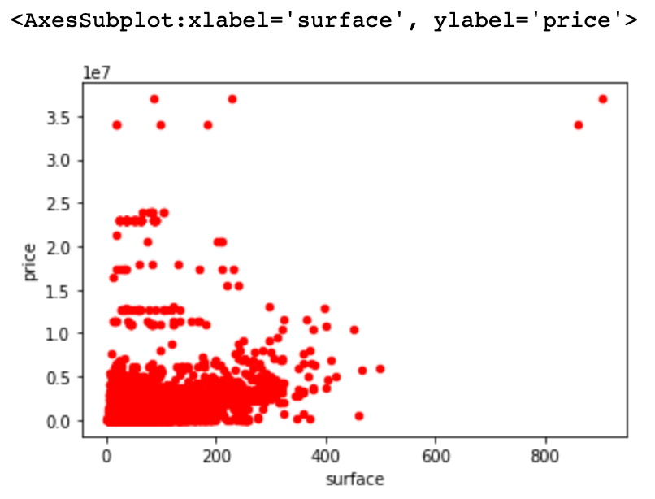
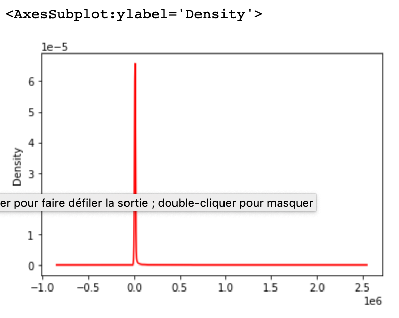
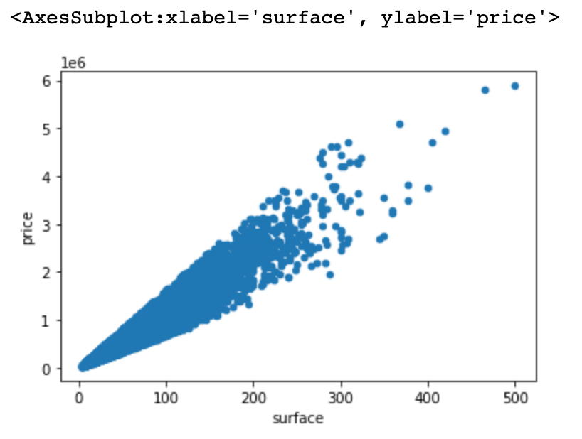
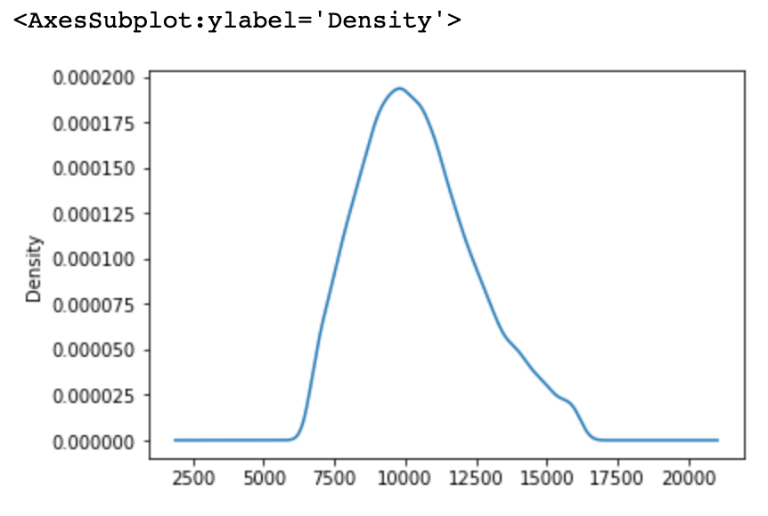
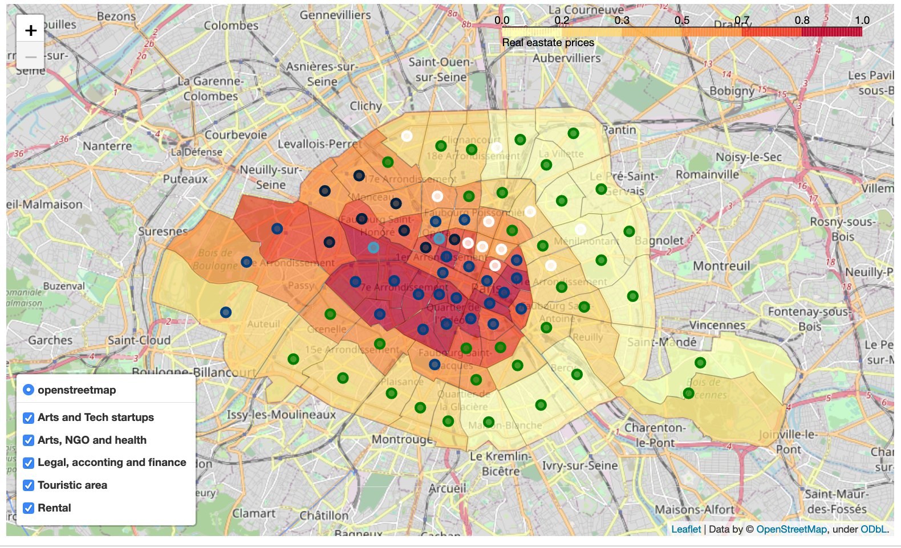

# Paris, the place to work

## Table of content
 - **[Introduction to business problem](#introduction-to-business-problem)**  
 - **[Data](#data)**  
   - [Paris shape](#paris-shape)
   - [Venues nearby](#venues-nearby)
   - [Companies list](#companies-list)
   - [Building prices](#building-prices)
 - **[Methodology](#methodology)**  
   - [Collecting data](#collecting-data)
   - [Data understanding](#data-understanding)
   - [Data preparation](#data-preparation)
   - [Modeling and evaluation](#modeling-and-evaluation)
   - [Deployment](#deployment)
   - [Feedback](#feedback)
 - **[Results](#results)**  
 - **[Discussion](#discussion)**  
 - **[Conclusion](#conclusion)**

## Introduction to business problem
More than 3000 companies are created each month in Paris[1](#1).  
And what are the 3 most important elements of success when you start a business ?
Location, location, and location !  
So, where is the best place for you to locate the premises of your brand new blockchain banking startup ?  
Not an easy task...  
Transportation is (hopefully) not really an issue in Paris. You will always be near a subway and not (so) far from your employees.
But everything else is important : venues nearby, other companies from the same business field... and of course price !  
In this capstone project we will study Paris by neighborhood to help you choose where to start your researchs

## Data
*Note: data set descriptions are in french, sorry for that*
### Paris shape
Since 1860, Paris is made of 20 arrondissements. Each one contains 4 neighborhoods. It makes 80 neighborhoods. Each one has a name and a police station :)  
The neighborhoods list and GeoJSON files will mostly be used to split data set by neighborhood and visualize results.  
They are available here as open data : https://opendata.paris.fr/explore/dataset/quartier_paris/  

### Venues nearby
Foursquare API will help us understand what kind of venues you have in all Paris Neighborhoods.  
### Companies list
Companies premises data will be used to list companies with their size, location and business field.  
Those data are avilable as open data from here : https://www.data.gouv.fr/fr/datasets/base-sirene-des-entreprises-et-de-leurs-etablissements-siren-siret/  
### Building prices
Price of premises to rent is not available easily.  
However, buying transactions are available as open data and are a good proxy for renting prices, so we'll use this.  
Multiple datasets are available but we'll prefer this dataset which contain latitude and logitude instead of address : https://www.data.gouv.fr/fr/datasets/demandes-de-valeurs-foncieres-geolocalisees/  

## Methodology
### Collecting data
Data were quite easily availble on the french government open data platform. Data sets are mostly country wide. Fortunatley, some people worked to split data set per department. As Paris is a whole department, it makes it easier to get the data.  
Splitted data set contribution also add latitude and logitude to the data set wich will be very useful in our case.  
### Data understanding
Once loaded, I realize that data sets contains lots of data I won't need in my analysis. I choose to load only the columns needed so my computer will be ablte to compute the data for the analysis.  
### Data preparation
Paris is splitted in neighborhood but the most commonly used terminology is the borrow, "arrondissement". Neighborrow (4 by borrow) are less used and not present in dataset. One of the first preparation was to add this information to the dataset.To do that, I created a function, based on latitude longitude and borrow (for computing time purpose), it gives the neighborrow.  
Most datasets were quite clean and did not need specific operations except buildings.  
### Companies
From the companies dataset, SCI were removed.  
SCI, *sociétés civiles immobilières*, are private companies made to own real estate. They are widely used to :
- own multiple aprtaments for rental
- own one one or multiple properties among multiple people (for example, own a family house with shares for all family members)
Those companies are not relevant in our analysis, so they were removed from the dataset  
#### Buildings
The buildings dataset contains all sold properties during last year. For our purpose, we will use only appartments data.  
As seen during data analysis, some prices seems not realistics.  
Graphs were used to define what are the best cleaning to apply to the dataset.  

*price versus surface before cleaning*  

*price index density graph before cleaning*  
We can see that there is lots of stange data points.  
I decided to remove exterme prices (approx. top and bottom 10%) so the data set is cleaner.  
Here is the result:  

*price versus surface after cleaning*  

*price index density graph after cleaning*  
Much better, isn't it ?  

### Modeling and evaluation
Neighborhoods were clustured based on data processed before.  
Then, results was vizualised on the map and most commun criteria displayed  
### Deployment
A cell was added where you can choose your cluster to display the most prefered neighborhood  
## Feedback
Waiting from yours :)  

## Results

We can clearly see the shape of Paris neighborhoods.  
Tech startups are mostly located in artistic neigborhoohs arround "bonne nouvelle" (mainly Sentier and the Marais). But they start spreading in the north where prices are a bit lower.  
Health and NGO are mostly in the cheapest neighborhood and not in the center.  
Legal, accounting and financial companies are located in the west, where richest people lives, which seems logical as they are their clients.  
In the most expensive neighborhood, we find a wide diversity: shops, restaurant, NGO, finance and arts. This is the historical center of Paris, with monuments where tourist are.  
Finally, 2 neighborhooss, in the west have a higher rate of rentals businesses. They are in the center, not far from the opera and the champs-Elysées, a great place to sleep when you visit Paris.  

## Discussion
We can see that Paris is very different from one neighborhoos to the other. It could be very interesting to place your company not far from people working in the same field as you are. A few years ago, places where even more different but as the prices grow, offices start moving from the center to the border. Sentier and the marais remains an intersting place for tech startups as many incubators are located here.  
We can see in the results that Foursquare data did not impact a lot the clusturing. That sound normal as the companies data taken into account in the study are nearly complete. They are based on companies declaration wich are mandatory. Foursquare data are based on contributions and will mainly add museum and touristic informations which are of course not included in companies list. It could be interesting to differentiate the 2 sources of data and see which clusturing will result.
Another intersting thing would be to extend the perimeter to some places arround Paris. For example, la défense, is a large business neighborhood but is located outside Paris. As prices increase in Paris, companies start also moving in cities just arround Paris. Public transportation is quite at the same level than in Paris but they can have better buildings and facilities. Including all cities arround Paris should give a better view of the companies eco-systems. This would include more data to download and clean which was complicated in the due time.  

## Conclusion
This was very interesting to start from the data, clean it and trying to get to a result. It was difficult to choose the best algorithm to make the analysis. As I spend lots of time finding and cleaning data, I did not have lots of time to explore other algorithm but would be interesting to try recommandation systems or others to go further in the analysis.

Tanks for reading :)

---
<a name="1">1</a> source infogreffe https://www.infogreffe.com/greffe-tribunal/greffe-paris/statistiques-greffe-paris.html
